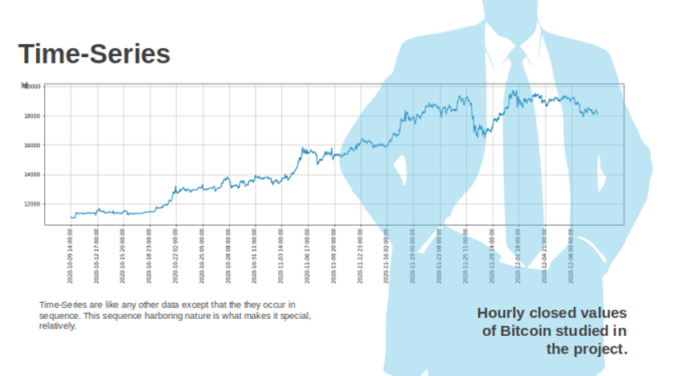
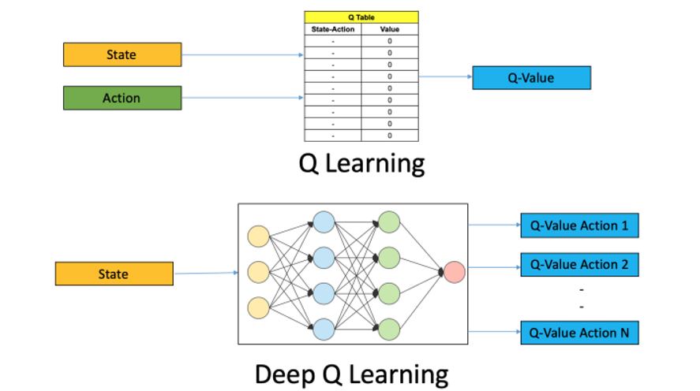
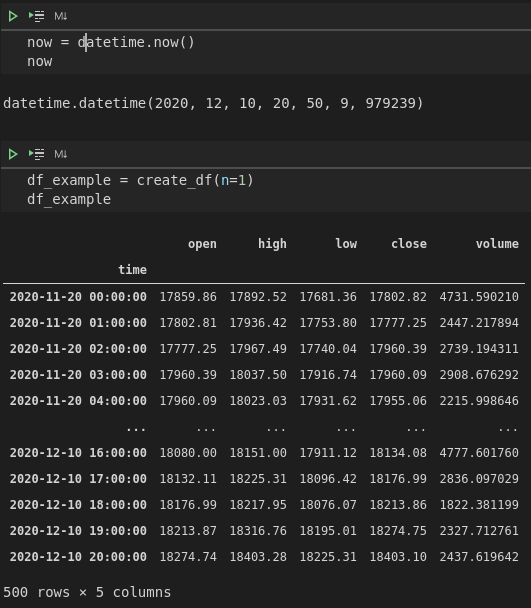
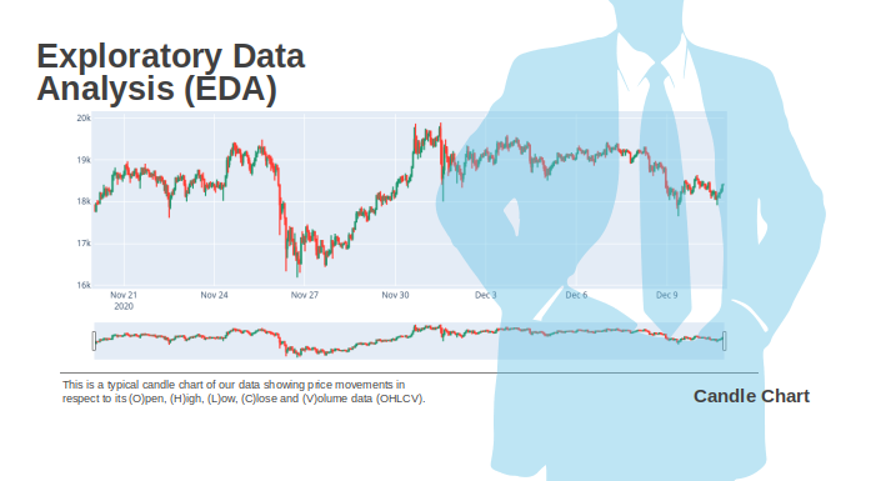
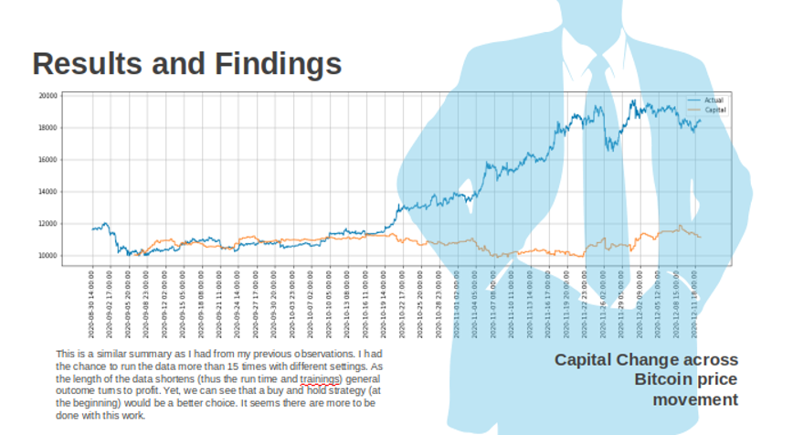

 A Deep Reinforcement Learning Application: Bitcoin Trading Agent 
  
 

 by Evrim Akgul 
  
 

 Sunday, December 13, 2020 
  
 
 
 

 MSDS 696 - Data Science Practicum II   

 Instructor: Christy Pearson 

 
 
 

# I. About the Project

As a student of Regis University, MSc. Data Science program, I was obligated to get two practica classes and turn in a project for each of the classes. I am coming from a background of Economics and Finance. For my first practicum class I picked a project something that I can put my finance and economics backround into it and I have repeated that in this one, my second practicum project, as well. I am hoping to contribute the project from this angle by providing information from the field along with the required technical information since this is a data science project.

Prelude:

I have to state this before everything, that this project is not aiming to make myself or somebody else rich. Financial markets - Cryptocurrency markets included - are complex structures and have unpredictable grounds. To profit in such an environment repeatedly and continuously is not an easy task, if not possible at all. Whilst, particularly investment companies, monetary institutions and every single entity trying to manage some funds (big or small) is after outsmarting the market. The most common way to do it is developing a trading strategy and stick to it. The purpose of this project is to show that an algorithmic approach that can come up with a strategy not predetermined is also an option. Please follow the rest of the presentation for the limits and spesifics of the this work.

PS: You may find my video presentation below

Summary:

The purpose of this project is to show that an algorithmic approach is also an option and/or that it has some potential to be an option with some refinement. During the project, I have used BTCUSDT price history, a time-series by nature, as my  data. My intention was to develop a deep reinforcement learning (**DRL**) agent that trades in Bitcoin market autonomously. In order to achieve that, I have used Q-learning approach from reinforcement learning (**RL**) methodologies that is bolstered with deep neural networks (**DNN**) to provide the approximations to the Q-values for the approach. 

I had the chance to run my model several times. DRL approach requires some serious repetitions in order to start producing decent results. I had the chance to observe that fact in my work, too. I have also found some bad results time to time on my lap, especially at attempts with a shorter training regimes. I believe this is a good example to show that there is no shortcut to success. I would like reiterate that there were unsuccesful runs. However, I can confirm that results get better as the algorithm runs again and again. Unfortunately, I added neither extra code in my work that can provide some benchmarks regarding this incremental development, nor I kept notes from my each run, yet I saved the weights of the model and re-used them during my next run. The results that will be showed in this presentation will be the results from the very last run, thus I expect it to be a good one (PS: I am writing these words before my last run to be used in this foreword).

    You may find the packages and Liabraries used in the project, as well as my references, at the very end of this `readme` document.

## Introduction

I come from economics/finance background and have high interest in subjects such as Time-Series and Neural Networks.
Before intending to do this project, I had Reinforcement Learning Class and successfully presented an Exchange Rate Prediction project (https://github.com/evrimakgul/Exchange_Rate_Prediction) at my first practicum. Small talks that I had with some of my close friends, trading on Bitcoin, merged with the other factors and brought this Bitcoin Trading Agent project in life.
The agent’s main algorithm is from Reinforcement Learning, it is a self-learning agent through trial-and-error.

Before providing detailed information about the agent I would like to discuss a few points, these are; purpose, expectations and limitations, so that I can augment some insight regarding the agent in terms of its capabilities.

# II. About the Agent

## Purpose

I have explained my motive already. Regarding the purpose of the project, I aimed to come up with a tool that can trade without supervision. Reinforcement Learning is the key approach for this purpose. As long as new data is provided, the agent applying the Reinforcement Learning technique gains experience and learns better and adapts better to the given situations. My expectations are not high, yet I am expecting my Bitcoin Trading Reinforcement Learning agent to accomplish somewhat successful trades and show some promise that this idea carries some potential.

## Expectations

It is obvious that some profit is expected from this agent, though there are no set limits for this aim. Since the agent will learn by experience in time, it should also be expected that the agent will have an exploratory attitude and search for different strategies, especially in the beginning. This being said that would be normal to observe the agent to have unsuccessful trades often. However it should settle with a rhythm in time and should have more successful trades than unsuccessful ones.

## Limitations

I have to emphasize some facts that will reflect as limitations to the agent. First of all, this agent will neither be golden goose nor aiming to make myself or somebody else rich. Financial markets - Cryptocurrency markets included - are complex structures and have unpredictable grounds. To profit in such an environment repeatedly and continuously is not an easy task, if not possible at all. Investment companies, money managing funds, teams and managers always have a game plan, and develop trading strategies. So it would not be wrong to say that it is another level. 
The purpose of this project is to show that an algorithmic approach that can come up with a strategy not predetermined is also an option. Yet it should not be expected as successful or consistent, due to the fact that it will not be as richly fed or supported.

Limitations (mostly because time and complexity reasons) are:
- lack of technical and fundamental indicators. I used none in my work,
- the method is limited to a simple Deep Q Network, 
- my workstation (or computation power),
- I have limited the training input (or states),
- I Also limited the active trades with 6 hours,
While each one of these items can be a limitation, they can also be thought as an idea to improve the robustness of the agent by internalizing these factors in the design.

# III. Components

## About Bitcoin and Time-Series

The instrument of this work is Bitcoin and as most of the financial data, Bitcoin is a time-series data. I used hourly Bitcoin data and my target variable to execute trades was closed values of the hourly data. Bitcoin rates are determined in cryptocurrency markets, which is open to buyers and sellers at all times, and where cryptocurrency trading is continuous. There are different cryptocurrency markets that can be traded on. Among these different markets, I picked Binance as my data provider, mostly because it is the largest exchange market and it has an API making things a little bit easier and convenient.

The crytpocurrency market is at its early development stages. As of now there is no goverment using it for means of exchange. Thus, the importance of cryptocurrencies are very limited and their impact is insignificant on the global and national economies. On the other hand, by making some transactions extremely easier and with the decentralized characteristic, cryptocurrencies promises more than a lot for the future of the global economy, hence, making successful trading on them quite important.

In terms of modelling forecast methods (and trading strategies in this example), it is essential to understand features of Bitcoin in order to develop decent models. First and foremost, Bitcoin is a sequenced data. The transactions are executed one after another and with a timestamp, hence they produce time-series data. Besides the sequenced nature of them, their other notable feature is that they are nonlinear and nonstationary, meaning they are nondirectional and ever changing without presenting any regularity.

With regard to modelling time-series data, there are two main approaches in the literature for time-series analysis: univariate and multivariate. The methods using the response variable (the variable that we are trying to predict) as its own predictor, this is called univariate. Alternatively, when we use other metrics for the prediction, that is a multivariate analysis. I used hourly Bitcoin data and my target variable to execute trades was closed values of the hourly data and I used it as a part of predictor function. On the other hand, I have used other hourly data (namely open, high and low) along with the volume data. Thus, it would not be wrong to consider this work as an multivariate time-series analysis. However, the aim, here, is not forecasting future prices, rather leveraging a machine learning method to develop a trading strategy, regardless of future price predictions.

## Reinforcement Learning

Reinforcement Learning is one of the three traditional approaches. It (RL) is a type of machine learning technique that enables an agent to learn in an interactive environment by trial and error using feedback from its own actions and experiences. This aspect of the Reinforcement Learning makes me think that a baby or a child learning her existence in her environment with trial and error. Similar to learning paradigm of a child, the reinforcement learning agent gets rewards and/or punishments for its actions with the environment. By doing so, it produces experience and strategy to interact with the environment.

 (Sutton & Barto, 2018) 

 

So, how do we explain this model mathematically? Let’s look at it.
We have an agent and an environment. Our understanding is this agent will interact with the environment. This is how it happens: 
The environment feeds the agent with a state, an information that is explaining what is happening in the environment. This happens at a specific time, let’s call it time T. Then , the agent takes this state, evaluates and acts upon it . Again at the given time T. With this the agent reaches into a new environment. Now the time is not T anymore. It became T+1.  When the agent reaches to this new environment at time T+1, it gets a feed back for its action at time T that we call reward. The environment is not the same, it is a new one, this is a similar to previous but a different environment now, at time T+1. Since the agent is now in a new environment, it should know about it as well, thus gets a feed from the environment, another state, for time T+1 that is explaining the new situation of the new environment to the agent. This cycle continues and that is how the interactions of an reinforcement learning agent with its environment is mathematically explained making reinforcement learning approach possible. As we define similar but new states, actions and rewards to an agent, agent will have the chance to interact with its environment and thus to actualize a reinforcement learning process.

As a note, I should add this as well. Machine Learning methodologies offer Recurrent Neural Networks (RNN) and Long-Short Term Memory (LSTM) approaches for sequence to squence data analysis as well. Yet, with the given time constraints, I had to exclude these methods. I am hoping to further analyse them as a continuation study to this project in the near future.

## Deep Q Learning

When we mathematically define possible actions that an agent can take, we are giving it options to choose from. In my work, these actions are BUY, HOLD or SELL, because this is a trader agent. What I expect is the agent to choose from these actions wisely in accordance with the situation that is provided to the agent as states. I used a method called Q-Learning regarding to produce this wise decision. Q-learning is a model-free reinforcement learning algorithm to learn quality of actions. By looking to the quality of these possible actions, agent chooses wisely (meaning the action with the best quality / q-value). 

 (from https://www.analyticsvidhya.com/blog/2019/04/introduction-deep-q-learning-python/) 

 

I will not go to the details how these values for each action is calculated mathematically, but there are a few things that I would like to mention.
First of all, my agent learns with trial-and-error. Since there is no pre-determined model is given to acquired the q-values, the agent will need a method of its own to acquire these q-values. Since the method is a trial-and-error method, the agent will not need fully correct q-values. Instead, some approximations of them are good enough to the agent, so that it can navigate from state to state. In order to provide these approximations, deep neural networks can be utilized and that is what I have done in this work. Instead of finding an exact q-value, the agent of this project takes states and finds some approximated values for each possible action and the agent uses them to determine their relative qualities.

# IV. The Data

## Source

Bitcoin is a traded meta in different markets. Among my options, I preferred to go with Binance due to its relative size of the market and the API that is associated to the platform. When I first started to acquire the data, I had two options: I was either going to scrape the data from their website with selenium, or to use their API. The ethical choice was to go through the API and that is what I have done. My problem was that I had not used any API before, thus I had to invest sometime to learn how to do that first. Eventually, I have acquired a few different types of data formats and in the end decided to go with the classical OHLCV (meaning Open, High, Low, Close, Volume) data. 
Their API was allowing to get 500 data points at a time. Without knowing how many data that I will be in need of, I wrote two functions, one allowing me to download chunks of 500 in the time order that I needed (very last 500 hours’ data point) and a second one formatting it into a dataframe regardless of the number of the chunks.

 

As you may follow from the image, a chunk comes with 500 data points, OHLCV information along with the hourly time information. I called to this data classical, due to the fact that trading data comes mostly as this and referred as candle sticks on the graph.

 

So, this is a typical candle chart graph of the data with volume statistics at the bottom. Reds are indicating lower close values relative to the opening values of the given hour, whilst greens indicating relatively higher close values. The graph starts with Bitcoin price a little under 12k and ends a little above 18k. By looking at this graph, my first impression is that the market was on a stagnant period between, mid September and mid October. Before that there is a bear market (meaning price drops in time), and a bull market (meaning price increase in time) after that, which goes to almost end of November, when prices volatility increases significantly. Even though the price volatility seemingly got lower at the end , the volume (amount of trade) is still very high (relatively), which can mean that there is still no settled direction for the price.

Under these circumstances, what should I expect from my agent? First, the training start with a high epsilon value. Epsilon is a hyperparameter that is used in RL to define the exploration tendency. Exploration and exploitation are two concepts regarding to the agents actions. It is quite simple actually. When the agent exploits, it takes the action that it evaluates as the best and when it explores, it tries something new, a new action it did not tried before. I used a gradually declining epsilon value, meaning that the agent will explore more in the beginning and less in time. According to the Bitcoin graph, my agent will learn to exploit trading during horizontal price movements, because it will have the first experience after the 170th data point, and that is close to the mid September. After that though, the agent will have a really reduced epsilon value, thus will try to exploit what it learned more. Therefore it should not be a surprise if it makes lots of losing trades during the bullish movement. One another point is the sharp price movements that happens at the very end. I cannot foresee something about that, because it will not have any experience for such sharp moves. Let’s look at the results now and interpret them.

# V. Conclusion

## Results and Findings

When I check the results in respect to my expectations I explained in previous section my observations are as followed:

- There are 154 buy and 167 sell actions executed.

- Considering that the price movements shows a bullish trend in general, I would expect, more buy trades and more successful trades in buy trades. It seems neither of my expectations valid. The interesting thing – to me – is the agent gets as successful in sell trades even though they are usually against the general trend. I suppose this could be assessed as a positive aspect.

- For the different time periods of the price movements, I would say, the agent was lucky with the trades at the beginning. It had more buy trades then sell trades during the bullish movement. Yet the total amount of trades executed at this period is significantly less than the other periods. As it can be expected, sell trades fails more than they succeed at this period.
- During the volatile section of the price movements (relatively short period of time at the end) agent has quite a few trades. This is another interesting observation to me.
I had some summary statistics in this slide. As I have restrained the agent to stay on a trade no more than 6 hours (or 6 steps), the average time steps that it was in trade is 3.67 steps.  The agent had 324 trades and stayed in trades for 1190 hours. In light of 2500 total data points (or hours), the agent preferred to stay out of the trade more than half of the time. In general, 53% of the trades are successful. This ratio is close to 54% in buy trades, whereas it is close 53% in sell trades. There were some ups and downs in trades, yet there is a capital gain at the end.

 

To me this graphic is telling me more. It is interesting that the agent failed trading in terms of capital gain during the bullish movement. That seems quite significant especially for the first half of the trend. It looks as if the volatile period of time is what the agent enjoys, as well as at times when there is no significant trend to talk about. One more assessment that I had is, the agent is having hard time to deal with extremely sharp price changes. We should also acknowledge that a buy and hold strategy would be more beneficial than the agent’s trading strategies.

I have had different tests with different size of data points in my short amount of time. My insight is that as the data points and the time of training increases, the robustness increases as well. Though this is just an intuition, I could had.  Unfortunately, I could not provide any statistically significant comparison results for them, because they were not so many. I would say I had maximum 20 tests with more than 2 hours training and less than 10 with 5+ hours training.

## Challenges

Before starting to this project, I have acquired a few sources to study. I was expecting things to be smoother. Yet during my study I realized that the challenge was bigger than I expected. The reason is teaching materials that I was able to find were not as good as in other applications of machine learning. Theoretically, the sources are good and helpful, but that is not the case for the application side of it. Especially time-series applications are very hard to find or decipher. I had to learn by debugging codes that I was able to find in order to gain some insight, that was quite a time consuming process, worried me time to time about the outcome of the project. I wish I could have more weeks to work on this. Another time related factor was the long training sessions. For some significant results, longer training hours (even days) seems a necessity. Nevertheless, it was a fun project to me and I found it very compelling yet with lots of promises.

## Lessons

I have uttered some of the lessons that I learned up to now. I may add, the effective coding among them. Since the trainings takes so long, effective and time-saving coding is important. As an idea, starting to trading with simpler forms (such as with a sinus function) and slowly adding elements to that could be a good ground for the agent to learn and act better. I also noticed that the agent had some actions contradicting with common sense. These could be due to the rewarding mechanism that I used and restrictions that I give to the agent. They might be considered as a weaknesses and can be treated accordingly. 

## Next

The next is actually simple. Giving more time to the project and experimenting more by changing all the restrains and weakness I identified so far. I would expect new trade-offs or new challenges to be identified as I would work on it.

# VI. Acknowledgements

As always, I would like to thank you for your interest to this project. I had some good challenges on the road and it was not easy to deal with them. I thank my instructor Christy Pearson so much for that reason. I cannot explain why but talking to her gives me all the soothing that I need, calms me down and puts me into the focused mind set to get the job done. I must thank to the coding community for sharing so much. There is always something I have to go check and the answer is always there to be found. Lastly, I would like to thank to sources of my references, as I used them vigorously.

Thank you, 
All the Best

 

***Packages and Liabraries***

*During this project I have used different packages and liabraries. First of all, this project is conducted on two basic elements: `Python` and `CSV` files. `CSV` files were the source of data acquired to be used in this project and the rest of the work is conducted by using `Python` language. From the `Python`, packages that are used:*
- *binance*
- *Pandas*
- *Numpy*
- *matplotlib*
- *plotly*
- *time*
- *datetime*
- *tensorflow (keras --> for deep learning)*
- *csv*

 

### References

* Sutton, R. S., &amp; Barto, A. G. (2018). Reinforcement learning: An introduction. Cambridge, MA: The MIT Press
* White, M., White, A. (n.d.). Fundamentals of Reinforcement Learning [MOOC]. Coursera.
https://www.coursera.org/learn/fundamentals-of-reinforcement-learning/home/info
* Lapan, M. (2020). Hands-on Deep Reinforcement Learning (Second ed.). Packt Publishing
* Starke, T. (2018, May 7). Reinforcement Learning for Trading - Practical Examples and Lessons Learned. Retrieved December 9, 2020, from https://www.slideshare.net/secret/1qorFuvmRdYNGR
* Vazquez, L. (2018, April 07). Understanding Q-Learning, the Cliff Walking problem. Retrieved January 15, 2021, from https://medium.com/@lgvaz/understanding-q-learning-the-cliff-walking-problem-80198921abbc
* Expected SARSA in Reinforcement Learning. (2020, September 02). Retrieved January 15, 2021, from https://www.geeksforgeeks.org/expected-sarsa-in-reinforcement-learning/
* Kinsley, H. (n.d.). Q-Learning In Our Own Custom Environment - Reinforcement Learning w/ Python Tutorial. Retrieved January 15, 2021, from https://pythonprogramming.net/own-environment-q-learning-reinforcement-learning-python-tutorial/?completed=%2Fq-learning-analysis-reinforcement-learning-python-tutorial%2F
* Patel, Y., mountaincar.py, (2017), GitHub repository, https://gist.github.com/yashpatel5400/049fe6f4372b16bab5d3dab36854f262
* Surma, G., (2019), GitHub repository, https://github.com/gsurma/cartpole
